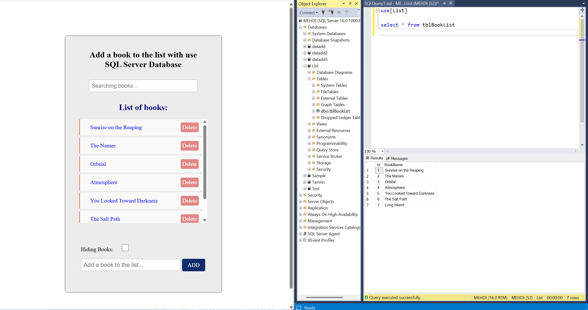

# JavaScript & SQL Server App

## Add a book to the list

 This book list app is built using **Vanilla JavaScript** and **SQL Server** to save data.

---

### ⚙️ Configuration

Below is a clear, step-by-step beginner-friendly guide that shows exactly how to do the following:

1. Please download app file and database file.

2. You must use SQL Server authentication

3. Please open the server.js file and set your SQL Server authentication username and password.

4. If you are using a different port, you need to update the URL in **origin** in the server.js file.

5. Please go to the project path on your system

Example:
```bash
D:\project\Book-List-Sql>node server.js    
```
    
6. Then open **Git Bash, CMD or PowerSell** in your project folder

7. Now run **node server.js** 

8. If you don't have Node.js you need to install it

9. How to install Node.js ?

- 🔗 https://nodejs.org

10. After installing Node, in **bash, cmd, powerSell** :

#### Install dependencies

```bash
npm install
node server.js
```

11. Run everything from server.js

12. Add (attach) a SQL Server **database** file

13. In the Sql select and run database file(List), and open tables file select dbo.tblBookList.

```sql
use [List]

select * from tblBookList
```

14. Now you can see the sql table

14. Run **index.html** in JavaScript App 

15. You can see the names of the seven books in the app form list as well as in the Sql Server table

16. Now everything is ready to start

---

#### ✨ The app advantage:

- Save data in Sql Server table

- Add book to list

- Show and hide book list

- Delete books

- Search for books

---

### 📸 Screenshots


