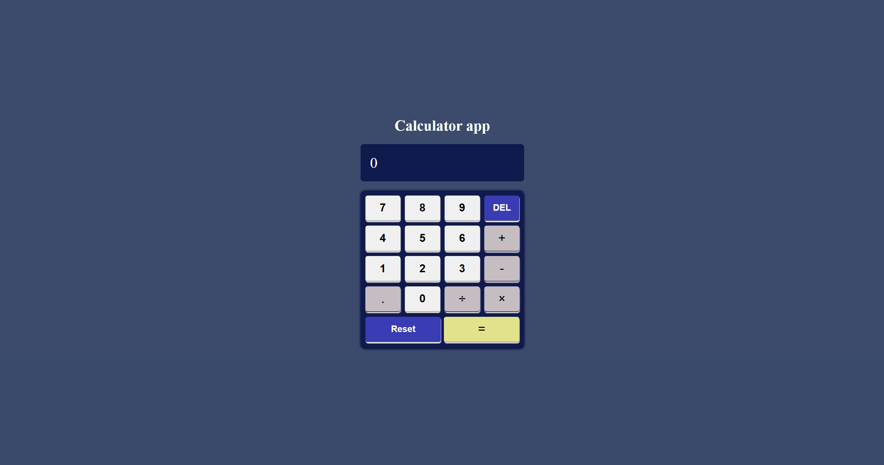
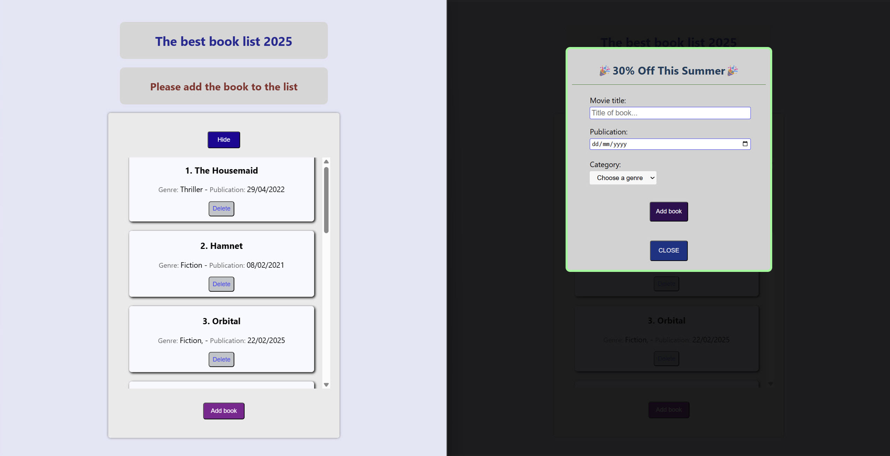
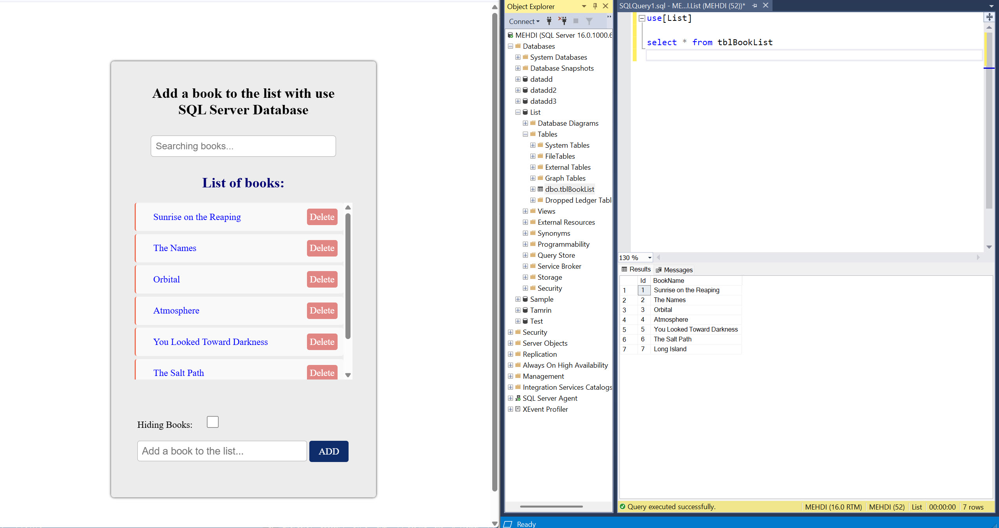

# 🛒 Online Book Store - Blue Stone News

This project is created for educational purposes only.

It is inspired by modern e-commerce bookstore designs and has no affiliation or connection with any real company.

---
## Project Overview

Online Book Store – Blue Stone News is a modern web application built with React, TypeScript, Tailwind CSS, and Vite that allows users to browse, search, and purchase books online.

 - Multiple categories including popular books, children’s books, and recommended titles.

 - Book details pages with descriptions, images, and add-to-basket functionality.

 - Search and filter functionality.

 - Shopping cart with product quantity management.

 - Tailored animations and responsive UI with Tailwind CSS.

---

### ⚡ Features

 - Home page with image slideshow and featured products.

 - Product pages for each book with synopsis, author info, and price.

 - Popular books section with detailed pages.

 - Basket functionality with quantity management.

 - Search functionality across multiple book sources (products, popular, child, recommend).

 - Filter sidebar for category, format, price, and language.

 - Sort dropdown (UI) by relevance, price, rating, or publication date.

 - Responsive design for mobile, tablet, and desktop.

 - Page transitions with animations using Framer Motion.

---

### 🛠 Technologies Used

 - React, TypeScript, Vite, Tailwind CSS

 - Context API for shopping cart

 - React Router DOM

 - Framer Motion for animations

 - Axios for HTTP requests

 - React Icons & Font Awesome for icons

 - Tailwind CSS customization for colors, fonts, and gradients

---

### 🔹 Getting Started

#### Prerequisites

Node.js v18+, npm

---

### ⚙️ Installation

1. Clone the repository:

```bash
git clone https://github.com/yourusername/online-book-store.git
cd Online-book-store

```

2. Install dependencies:

```bash
npm install

```

3. Start the development server:

```bash
npm run dev

```

---

### API Endpoints

This project uses a mock JSON server at `http://localhost:3001`. endpoints:

 - /products
 - /childproducts
 - /recommendbooks
 - /popular
 - /orderBooks
 - /rating

---

To see images of some of the BookStore pages, visit the folder below:

public/images-pages

---

### 🎨 Tailwind CSS Customization

   - Custom colors, fonts, backgrounds, and gradients for branding and books

---

#### Screenshot


;; #  React Calculator App

;; ## Introduction

;; The React Calculator App is a web application.

;; This App provides a user-friendly interface and It supports basic arithmetic operations, decimal numbers, formatted output, and intuitive input handling similar to a real calculator.

;; ---

;; ### 🔢 Features

;; - Addition, Subtraction, Multiplication, Division

;; - Decimal number support with precision control

;; - Smart input handling (prevents invalid sequences)

;; - Automatic number formatting

;; - Continue calculation after =

;; - Delete last input & reset calculator

;; ---

;; ### 🛠 Installation

;; 1. Clone the repository

;; 2. Navigate to the project folder

;; 3. Install dependencies
;; ```terminal
;;   npm install
;; ```

;; 4. Start the development server
;; ```terminal
;;   npm run dev
;; ```

;; 5. Open the app in your browser

;; ---

;; ### 💡 How It Works

;; - User input is stored as a raw expression array

;; - The display shows a formatted version of the numbers

;; - When = is pressed:

;;     - The expression is parsed into numbers and operators

;;     - The calculation runs left-to-right

;;     - The result is rounded to avoid floating-point errors

;; - After calculation:

;;     - Pressing a number starts a new calculation

;;     - Pressing an operator continues from the result

;; ---

;; ### ⚠️ Known Limitations:

;; Operations are evaluated left-to-right

;; ```
;;   2 + 3 × 4 = 20
;; ```
;; ---

;; ### 📄 License

;; This project is open-source and available under the MIT License.

;; ---

;; ### 📸 Screenshots

;; 


;; ================================


;; # React App

;; ## 📚 Adding books to the list using **json-server**

;; ---

;; ### 🛠 Configuration

;; In this App, we are going to have a list of books that we can use and be able to add and delete them.

;; We first created a list for books, where we can add new books and also delete or hide them.

;; We use **json-server** to do things and we are able to save books or add and remove from the list.

;; The add book form is displayed as a **modal**.

;; ### 🔸 After download:

;; ```terminal
;;     npx json-server --watch data/db.json port3000

;;     npm run start
;; ```

;; Everything is ready now.

;; ---

;; #### 🔹 App Advantage:

;; - Add a book to the list.

;; - Save & Delete from json-server.

;; - Show & hide items.

;; ---

;; ### 📸 Screenshots

;; 


;; =======================================


;; # 🌐 Local weather app

;; ## 🔸 About the Project:

;; This weather app is built using **Vanilla JavaScript** and displays real-time weather conditions.

;; ### Current weather data
;; - Weather App using OpenWeatherMap API & ip-api.com

;;   - 🔗 https://openweathermap.org/api
;;   - 🔗 https://ip-api.com

;; - A weather app made using OpenWeatherMap API in Vanilla JavaScript.

;; - The app tells the current temperature in Celsius, Fahrenheit, and Kelvin, as well as some additional information like Location Timezone, WeatherMain(Icon), WeatherDescription.

;; ## ⚙️ Configuration
;; - If you want to use the OpenWeatherMap API, you need to get an API key. To set up your API key, follow these steps:

;; - Go to the OpenWeatherMap website: 🔗 https://openweathermap.org/
;; - Sign up for a free account or log in if you already have an account.
;; - Once logged in, go to your profile and navigate to the "API Keys" section.
;; - Generate a new API_key and copy it. 

;; - In the project directory, find the app.js file. Inside this file, you will find a constant called API_KEY. Replace the value 'API_KEY' with your actual API key that you received from OpenWeatherMap.

;; ---

;; #### ✨ The app shows:

;; - Current temperature in **Celsius, Fahrenheit, and Kelvin**
;; - Location **timezone**
;; - Weather condition **icon**
;; - Weather **humidity**
;; - Weather **description**
;; - Real-time local **clock**

;; ---

;; ### 📸 Screenshots

;; 


;; ==============================================


;; # 📚 JavaScript & SQL Server Book List App

;; ## Add a book to the list

;;  This book list app is built using **Vanilla JavaScript** and **SQL Server** to save data.

;; ---

;; ### ⚙️ Configuration

;; Below is a clear, step-by-step beginner-friendly guide that shows exactly how to do the following:

;; **1.** Please download app file and database file.

;; **2.** You must use SQL Server authentication.

;; **3.** Open the server.js file and set your SQL Server authentication username and password.

;; **4.** If you are using a different port, Update the URL in **origin** in the server.js file.

;; **5.** Go to the project path on your system.

;; **6.** Open **Git Bash, CMD or PowerSell** in your project folder.

;; Example:
;; ```bash
;; cd D:\project\Book-List-Sql>
;; node server.js
;; ``` 
;; #### Attention:

;; **7.** If you don't have Node.js you need to install it.

;; **8.** How to install Node.js?

;; - 🔗 https://nodejs.org

;; **9.** After installing Node, in **bash, cmd, powerSell** :

;; #### Install dependencies

;; ```bash
;; npm install
;; node server.js
;; ```

;; **10.** Run everything from server.js.

;; **11.** Add (attach) a SQL Server **database** file

;; **12.** In SQL Server, select and run database file(List), and open the tables file select dbo.tblBookList.

;; ```sql
;; use [List]

;; select * from tblBookList
;; ```

;; **13.** Now you can see the SQL table.

;; **14.** Run **index.html** in the JavaScript App. 

;; **15.** You will see the list of seven books from both the app and SQL Server table.

;; **16.** Everything is now ready to start.

;; ---

;; #### 🔹 App Advantage:

;; - Save data in SQL Server table

;; - Add a book to the list

;; - Show and hide the book list

;; - Delete books

;; - Search for books

;; ---

;; ### 📸 Screenshots

;; 
